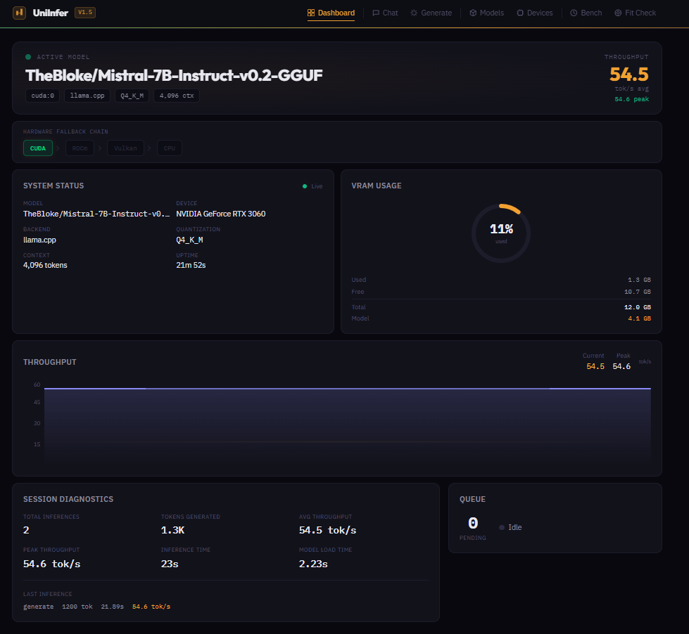
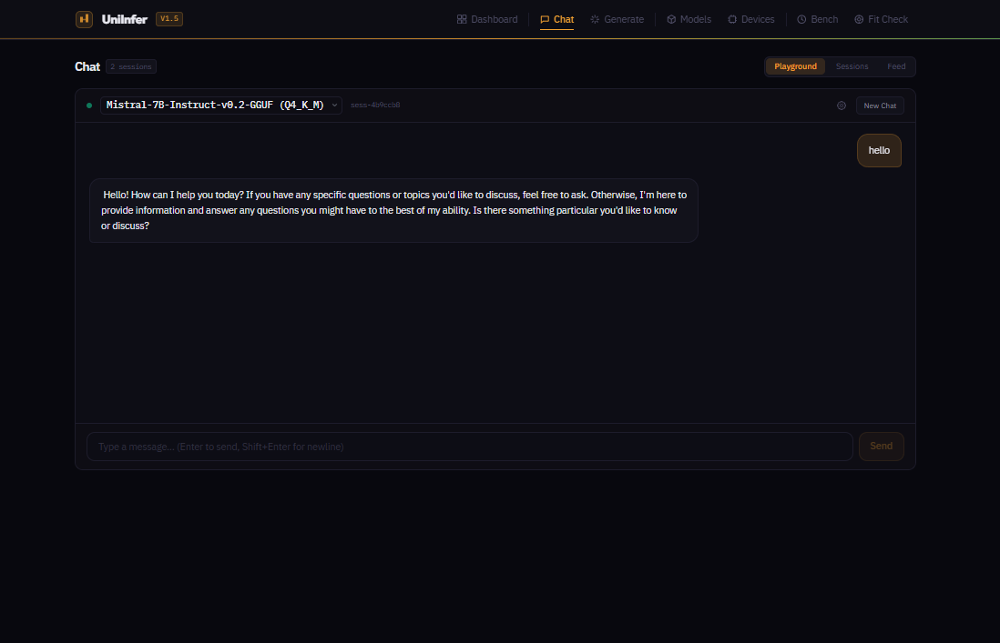
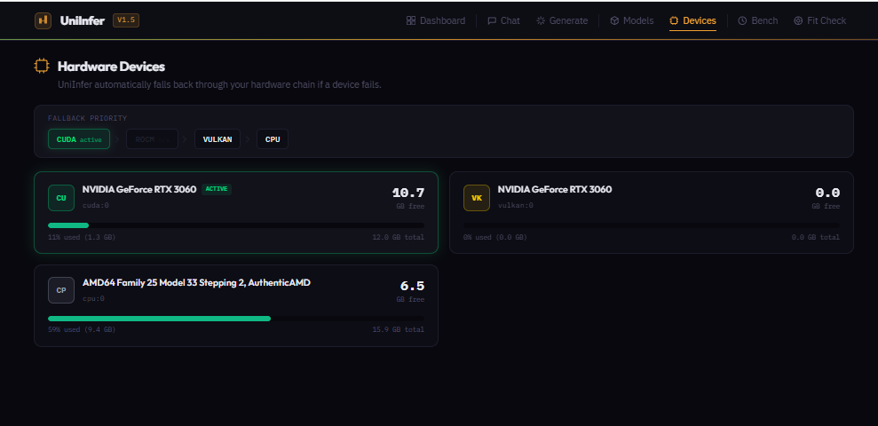
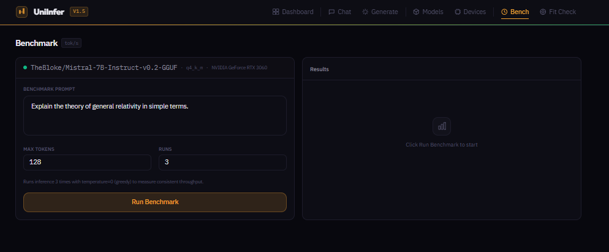

# UniInfer

**Run any LLM on any hardware.** Auto-detects your GPU, checks if the model fits, downloads the right format, and starts serving — zero configuration.

```bash
pip install -e .
uniinfer serve
```

Open `http://localhost:8000/dashboard` and you're running.



---

## What UniInfer Does

1. **Detects your hardware** — NVIDIA (CUDA), AMD (ROCm), Vulkan, or CPU
2. **Checks if the model fits** — calculates VRAM budget *before* downloading
3. **Downloads the right format** — GGUF, ONNX, or SafeTensors from HuggingFace
4. **Loads on the best device** — with automatic fallback if a device fails
5. **Serves an OpenAI-compatible API** — drop-in replacement for any client

No driver matching. No format conversion. No OOM crashes.

---

## Getting Started

### Install

```bash
# Clone and install
git clone https://github.com/Julienbase/uniinfer.git
cd uniinfer
pip install -e .
```

For NVIDIA GPU acceleration (recommended):

```bash
CMAKE_ARGS="-DGGML_CUDA=on" pip install llama-cpp-python --force-reinstall --no-cache-dir
```

### Start the Server

```bash
# Start with no model — load from dashboard
uniinfer serve

# Or start with a model directly
uniinfer serve --model mistral-7b
```

Open `http://localhost:8000/dashboard` in your browser.

### Load a Model

From the **Models** tab, pick an alias or paste any HuggingFace model ID. UniInfer auto-detects the format and downloads it.


Supported formats: **GGUF** (llama.cpp), **ONNX** (ONNX Runtime), **SafeTensors** (transformers). All auto-detected.

### Chat

Switch to the **Chat** tab. Type a message, get streaming responses. Session history is preserved.



---

## Fit Check — Know Before You Download

UniInfer's standout feature: check if a model fits your VRAM *before* downloading gigabytes of data.

Go to the **Fit Check** tab, select a model, and instantly see:

- Whether it fits your GPU
- Memory breakdown (model + KV cache + overhead + headroom)
- Every quantization option and which ones fit
- A recommended quantization if the default doesn't fit

**Model fits:**


**Model doesn't fit:**


The same check runs automatically when you download or load a model — from the dashboard, CLI, or Python SDK. You'll never waste bandwidth on a model that won't run.

### From the CLI

```bash
$ uniinfer run --model llama-3.1-8b --dry-run

UniInfer — Smart Model Fit Check

Discovering hardware... NVIDIA GeForce RTX 3060 (11.2 GB free)
Model: Llama 3.1 8B Instruct (8.0B params)

┌─────── Fit Report ───────┐
│ Status:    FITS           │
│ Model:     ~4.5 GB        │
│ Available: 11.2 GB        │
│ Headroom:  +4.0 GB        │
└──────────────────────────┘
```

---

## Hardware Fallback

UniInfer detects all your hardware and automatically falls back if a device fails:

```
CUDA → ROCm → Vulkan → CPU
```

Each device is health-checked before use. If your CUDA driver crashes, UniInfer retries on the next available device — no manual intervention.



The **Devices** tab shows all detected hardware with live memory usage.

---

## Dashboard

The web dashboard at `http://localhost:8000/dashboard` gives you full control:

| Tab | What it does |
|-----|-------------|
| **Dashboard** | Live model status, VRAM gauge, throughput chart, queue depth, diagnostics |
| **Chat** | Interactive chat playground with streaming, session history |
| **Generate** | One-shot text generation |
| **Models** | Download, load, delete models. Browse aliases. Hot-swap without restart |
| **Devices** | Hardware listing with memory usage and fallback priority |
| **Bench** | Run inference benchmarks with configurable prompt and token count |
| **Fit Check** | Pre-download VRAM validation with quantization alternatives |

### Benchmark



---

## CLI Reference

```bash
# ─── Server ───────────────────────────────────────
uniinfer serve                          # Start server (load model from dashboard)
uniinfer serve --model mistral-7b       # Start with a model
uniinfer serve --port 9000              # Custom port

# ─── Chat ─────────────────────────────────────────
uniinfer chat --model mistral-7b        # Local chat (loads own engine)
uniinfer chat --server                  # Chat via running server
uniinfer chat --server --port 9000      # Chat via server on custom port

# ─── Generate ─────────────────────────────────────
uniinfer generate --model mistral-7b --prompt "Hello world"

# ─── Models ───────────────────────────────────────
uniinfer pull --model mistral-7b        # Pre-download a model
uniinfer list                           # List cached models
uniinfer aliases                        # Show available model aliases

# ─── Hardware ─────────────────────────────────────
uniinfer devices                        # List detected hardware

# ─── Benchmark ────────────────────────────────────
uniinfer bench --model mistral-7b       # Run throughput benchmark

# ─── Fit Check ────────────────────────────────────
uniinfer run --model llama-3.1-8b --dry-run   # Check fit without loading
```

---

## Python SDK

### Quick Start

```python
import uniinfer

# One-line chat
response = uniinfer.chat("mistral-7b", "What is gravity?")
print(response)

# Stream tokens
for chunk in uniinfer.chat_stream("mistral-7b", "Write a poem about code."):
    print(chunk, end="", flush=True)
```

### Engine API (Full Control)

```python
from uniinfer import Engine

engine = Engine(model="mistral-7b")

# Chat
result = engine.chat([
    {"role": "user", "content": "Explain quantum computing in simple terms."}
])
print(result.text)

# Multi-turn conversation
result = engine.chat([
    {"role": "user", "content": "My name is Julien."},
    {"role": "assistant", "content": "Nice to meet you, Julien!"},
    {"role": "user", "content": "What is my name?"},
])

# Stream tokens
for chunk in engine.chat_stream([
    {"role": "user", "content": "Write a haiku about code."}
]):
    print(chunk.text, end="", flush=True)

# Raw text generation
result = engine.generate("The history of computing began", max_tokens=200)

# Force a specific device
engine = Engine(model="mistral-7b", device="cuda:0")
engine = Engine(model="mistral-7b", device="cpu")

# Diagnostics
info = engine.info()
print(info["diagnostics"])  # {"average_tokens_per_second": 56.8, ...}
print(info["fit"])           # {"fits": true, "headroom_gb": 7.9, ...}
```

### REST API (OpenAI-Compatible)

Any OpenAI client works out of the box:

```bash
curl http://localhost:8000/v1/chat/completions \
  -H "Content-Type: application/json" \
  -d '{"model": "mistral-7b", "messages": [{"role": "user", "content": "Hello"}]}'
```

```python
from openai import OpenAI

client = OpenAI(base_url="http://localhost:8000/v1", api_key="unused")
response = client.chat.completions.create(
    model="mistral-7b",
    messages=[{"role": "user", "content": "Hello"}],
    stream=True,
)
for chunk in response:
    print(chunk.choices[0].delta.content or "", end="")
```

---

## Model Aliases

Use short names instead of full HuggingFace repo IDs:

| Alias | Model | Params | Context |
|-------|-------|--------|---------|
| `tinyllama-1b` | TinyLlama 1.1B Chat | 1.1B | 2,048 |
| `gemma-2b` | Gemma 2 2B Instruct | 2.5B | 8,192 |
| `phi-3-mini` | Phi-3.1 Mini 4K Instruct | 3.8B | 4,096 |
| `mistral-7b` | Mistral 7B Instruct v0.2 | 7.2B | 4,096 |
| `qwen-2.5-7b` | Qwen 2.5 7B Instruct | 7.6B | 4,096 |
| `llama-3.1-8b` | Llama 3.1 8B Instruct | 8.0B | 8,192 |
| `llama-3.3-70b` | Llama 3.3 70B Instruct | 70.6B | 4,096 |

Or use any HuggingFace model ID directly: `TheBloke/Mistral-7B-Instruct-v0.2-GGUF`, `onnx-community/gemma-3-1b-it-ONNX`, etc.

---

## Supported Hardware

| Hardware | Backend | Detection |
|----------|---------|-----------|
| NVIDIA GPUs (CUDA) | llama.cpp, transformers | pynvml |
| AMD GPUs (ROCm) | llama.cpp, transformers | rocm-smi |
| Vulkan GPUs | llama.cpp | vulkaninfo |
| CPU (x86/ARM) | llama.cpp, ONNX Runtime, transformers | psutil |

All hardware is auto-detected. CPU is always available as fallback.

## Supported Model Formats

| Format | Backend | Auto-Detected By |
|--------|---------|------------------|
| GGUF | llama.cpp | File extension + magic bytes |
| ONNX | ONNX Runtime | File extension |
| SafeTensors | transformers | Directory contents |

Drop in any format — UniInfer auto-detects and routes to the right backend.

---

## How It Works

```
Your code (Python SDK / REST API / CLI / Dashboard)
                    │
                UniInfer Engine
    ┌───────────────┼───────────────┐
    │               │               │
 Fit Check    Auto-Download    Fallback Chain
 (VRAM budget)  (HuggingFace)   (retry on failure)
                    │
        ┌───────────┼───────────┐
        │           │           │
    llama.cpp   ONNX Runtime  transformers
     (GGUF)      (ONNX)     (SafeTensors)
        │           │           │
   ┌────┴────┬──────┴─────┬─────┴────┐
   │ NVIDIA  │   AMD      │  Vulkan  │  CPU
   │ (CUDA)  │  (ROCm)    │          │
   └─────────┴────────────┴──────────┘
```

1. **Detect** — Probes CUDA, ROCm, Vulkan, CPU. Ranks by type and available memory.
2. **Fit** — Calculates model size + KV cache + overhead. Validates against available memory. Recommends alternatives if it doesn't fit.
3. **Download** — Resolves aliases, detects repo format, downloads the right files.
4. **Load** — Routes to the correct backend with GPU offloading. Falls back through the device chain on failure.
5. **Serve** — OpenAI-compatible REST API with async scheduling and SSE streaming.

---

## License

MIT
